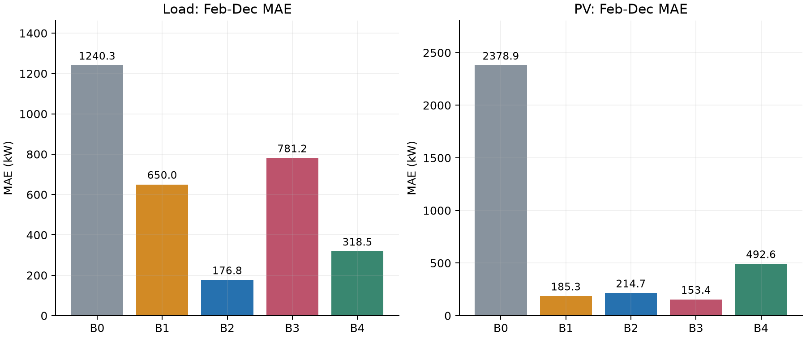
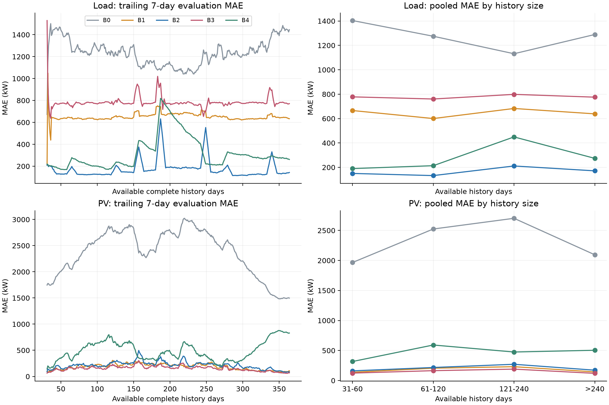

# Seasonal Baseline Report — Q2 / B0–B4

**范围：只使用附件2，2025-02-01至2025-12-31每日00:00预测当天144个区间。没有使用附件3/4、result模板、深度模型或LP/MPC。**

本轮得到480,960条预测记录（334天×144步×2条序列×5种方法）；59项测试全部通过。下文“最强”指固定方法在本次Feb–Dec评估上的事后MAE排名，不是使用test集选择上线模型或超参数。

## 全局结果

| series | model | n | mae_kw | rmse_kw | nmae | daylight_mae_kw |
|---|---|---|---|---|---|---|
| Load | B0 | 48,096 | 1240.2651 | 1651.3829 | 26.86% | N/A |
| Load | B1 | 48,096 | 650.0201 | 1128.3912 | 14.08% | N/A |
| Load | B2 | 48,096 | 176.7957 | 244.2866 | 3.83% | N/A |
| Load | B3 | 48,096 | 781.2111 | 955.9245 | 16.92% | N/A |
| Load | B4 | 48,096 | 318.5404 | 415.4876 | 6.90% | N/A |
| PV | B0 | 48,096 | 2378.8535 | 3826.0687 | 100.00% | 4256.4487 |
| PV | B1 | 48,096 | 185.3465 | 375.1749 | 7.79% | 331.6338 |
| PV | B2 | 48,096 | 214.6882 | 419.9480 | 9.02% | 383.9103 |
| PV | B3 | 48,096 | 153.3997 | 303.8577 | 6.45% | 274.3842 |
| PV | B4 | 48,096 | 492.6306 | 787.3104 | 20.71% | 856.4944 |

MAE/RMSE单位kW；nMAE=MAE/同组mean(|actual|)。PV daylight-only严格以事后actual>0筛选；夜间0值不进入该子集，未传给预测器。全日MAE即表中mae_kw。

## 1–2. Load和PV最强简单baseline

Load：**B2 (Last Week Same Slot)**，MAE=176.7957 kW，RMSE=244.2866 kW，nMAE=3.83%。MAE排名：B2 < B4 < B1 < B3 < B0。

PV：**B3 (Previous 7-day Same-Slot Mean)**，MAE=153.3997 kW，RMSE=303.8577 kW，nMAE=6.45%。MAE排名：B3 < B1 < B2 < B4 < B0。

## 3. Weekly seasonality是否非常强？

Load：B2相比B1的MAE降低72.80%，在61.68%的评估日胜出；支持较强的周周期信号。这是预测对照证据，不是独立样本下的显著性检验。

PV：B2相比B1的MAE升高15.83%，在38.02%的评估日胜出；不足以称为非常强的周周期信号。这是预测对照证据，不是独立样本下的显著性检验。

## 4. Moving-average是否对PV更强？

PV的B3 MAE=153.3997 kW；相比B1降低17.24%，相比B2降低28.55%。B3同时优于这两个单日季节基线。是否为所有方法中最佳，以全局表为准，不能预设均值法一定适合PV。

## 5. 只有31天历史时的性能

2025-02-01恰有31个完整历史日、4,464个可见区间。最后一格于02-01 00:00 rank0可读，先于同刻rank2决策。B0实际只用1点，B1/B2用1天，B3用7天，B4用1月份4个同weekday日；available_history_days并不等于每个方法的实际输入量。

| series | model | mae_kw | rmse_kw | nmae | daylight_mae_kw |
|---|---|---|---|---|---|
| Load | B0 | 672.1821 | 856.6726 | 21.14% | N/A |
| Load | B1 | 209.9798 | 252.1704 | 6.60% | N/A |
| Load | B2 | 209.4526 | 248.5712 | 6.59% | N/A |
| Load | B3 | 1529.1218 | 1657.6611 | 48.09% | N/A |
| Load | B4 | 219.0136 | 252.8674 | 6.89% | N/A |
| PV | B0 | 1746.9596 | 2995.1755 | 100.00% | 3543.1293 |
| PV | B1 | 101.2014 | 195.1477 | 5.79% | 205.2535 |
| PV | B2 | 89.3481 | 160.3530 | 5.11% | 181.2130 |
| PV | B3 | 63.8710 | 119.7641 | 3.66% | 129.5411 |
| PV | B4 | 142.5495 | 242.5212 | 8.16% | 289.0605 |

31天精确条件只对应一个预测日，不能用这一天代表整个低数据分布。2月份整体另报如下（历史量31–58天）：

| series | model | n | mae_kw | rmse_kw | nmae |
|---|---|---|---|---|---|
| Load | B0 | 4,032 | 1425.5604 | 1862.3484 | 31.56% |
| Load | B1 | 4,032 | 638.3035 | 1124.0981 | 14.13% |
| Load | B2 | 4,032 | 146.4379 | 184.3820 | 3.24% |
| Load | B3 | 4,032 | 764.7927 | 948.4122 | 16.93% |
| Load | B4 | 4,032 | 183.5432 | 218.2701 | 4.06% |
| PV | B0 | 4,032 | 1966.4803 | 3304.5986 | 100.00% |
| PV | B1 | 4,032 | 132.0810 | 274.8498 | 6.72% |
| PV | B2 | 4,032 | 159.7156 | 313.3450 | 8.12% |
| PV | B3 | 4,032 | 116.5683 | 231.3441 | 5.93% |
| PV | B4 | 4,032 | 320.4832 | 548.5084 | 16.30% |

## 6. 随历史积累是否改善？

| series | model | 31-60 days | 61-120 days | 121-240 days | >240 days |
|---|---|---|---|---|---|
| Load | B0 | 1403.6063 | 1274.9938 | 1131.5101 | 1289.1898 |
| Load | B1 | 665.8556 | 600.2197 | 682.7165 | 638.6441 |
| Load | B2 | 150.1572 | 132.4637 | 211.2420 | 171.3564 |
| Load | B3 | 777.9483 | 760.3478 | 798.3903 | 775.4705 |
| Load | B4 | 189.9402 | 213.5976 | 449.4507 | 273.7447 |
| PV | B0 | 1966.0587 | 2524.1679 | 2702.5447 | 2095.1604 |
| PV | B1 | 137.8676 | 205.2060 | 230.5345 | 143.4935 |
| PV | B2 | 161.0465 | 217.2080 | 270.7135 | 172.2288 |
| PV | B3 | 123.9142 | 164.3293 | 190.0999 | 119.7285 |
| PV | B4 | 316.7887 | 591.7067 | 475.1132 | 504.1854 |

Load的全局最佳B2从31–60天组到>240天组，MAE升高14.12%；四组并非单调不增。

PV的全局最佳B3从31–60天组到>240天组，MAE降低3.38%；四组并非单调不增。

**不能把上述变化直接归因于数据量增长。** B0/B1/B2/B3只使用固定长度的近期历史，不因累计历史增加而学习更多；只有B4的平均样本数扩展。历史天数与季节、月份完全联动，当前设计不能分离这些因素，也未人为缩减历史做固定季节对照。

## 7. 哪些horizon最难？

Load以B2为参照的最高误差3个区间：h=135 / 22:20–22:30 / MAE=218.38 kW；h=123 / 20:20–20:30 / MAE=213.01 kW；h=111 / 18:20–18:30 / MAE=211.24 kW。

PV以B3为参照的最高误差3个区间：h=73 / 12:00–12:10 / MAE=502.07 kW；h=71 / 11:40–11:50 / MAE=496.73 kW；h=72 / 11:50–12:00 / MAE=495.08 kW。

| series | model | horizon | interval | mae_kw |
|---|---|---|---|---|
| Load | B0 | 55 | 09:00–09:10 | 2461.2998 |
| Load | B1 | 106 | 17:30–17:40 | 1135.9828 |
| Load | B2 | 135 | 22:20–22:30 | 218.3816 |
| Load | B3 | 106 | 17:30–17:40 | 1468.0367 |
| Load | B4 | 124 | 20:30–20:40 | 468.7533 |
| PV | B0 | 73 | 12:00–12:10 | 7759.6213 |
| PV | B1 | 73 | 12:00–12:10 | 634.5565 |
| PV | B2 | 73 | 12:00–12:10 | 690.9647 |
| PV | B3 | 73 | 12:00–12:10 | 502.0727 |
| PV | B4 | 74 | 12:10–12:20 | 1053.0915 |

每天均从00:00预测，因此horizon同时等于日内时刻。不能仅凭曲线认为远期步长天然更难；负载峰谷和PV日照强度同样影响绝对误差。PV夜间实际均为0的horizon分母为0时，nMAE记为NaN，不伪装为0。

## 8. Causality检查结果

| phase | tests | failed | skipped |
|---|---|---|---|
| preflight_tests | 45 | 0 | 0 |
| postflight_tests | 14 | 0 | 0 |

未发现因果性违规。预检覆盖事件字典序、1月末样本边界、日期/slot唯一性和连续性、B0–B4精确输入集合、拒绝未来/迟到/乱序/缺失输入、未来值污染不变性、无scaler以及模型保存/加载。回测后逐行检查480,960条输出和3,340条输入来源记录，并用独立数组实现重算全部B0–B4预测与真值对齐。

测试不是“无风险”的逻辑证明；它们覆盖当前输入、实现和冻结协议。真实数据若存在未建模的发布延迟，需要修改available_event；当前按用户授权的零延迟rank0约定执行。

## 9–10. 后续DLinear和PatchTST至少要超过谁？

DLinear至少应在同样事件协议、单变量任务和目标日上超过Load的**B2**与PV的**B3**，同时完整保留B1/B2/B3/B4及月度、低历史量对照。这里只给出本次事后最强简单基线，不能按全年成本或test MAE选择深度模型超参数。

PatchTST至少达到相同的简单基线门槛，并在DLinear正式完成后继续比较DLinear。DLinear/PatchTST均未运行，所以当前不能声称它们优于任何基线；将来调参必须只用每个forecast origin之前的chronological validation。

## 时间和输出定义

依据TIME_PROTOCOL.md：源00:10解释为[00:00,00:10)的结束标签，是建模约定。source_day永远保留原始日期；slot_id由解析后的结束分钟计算，全年每条序列52,560个区间、365个完整日。source_timestamp=interval_end；一个source_day严格覆盖[00:00,24:00)。

predictions.csv中history_start/history_end为可用历史区间起止，history_end等于decision_time是合法的，因为rank0<rank2。input_available_at/input_available_rank记录本模型实际使用输入的最晚可用事件。lineage.csv列出全部使用日期及样本数。target_power_kw是预测冻结后加入的结算真值，不能将含真值的整表作为后续优化器输入。

本轮不填result模板，也不把其错误边界反向用于canonical时间轴。后续submission mapping单独处理。

## 复现与交付

在项目目录执行：` .\.venv\Scripts\python.exe run_baselines.py `。入口先运行因果性测试，失败立即停止；生成预测后再次审计全部结果，再生成指标、图片和本报告。随机种子2026；无随机划分、无深度训练、无scaler。所有指标由预测CSV程序生成，未手工填数。

- artifacts/baselines/predictions.csv：480,960条逐slot评估记录。
- artifacts/baselines/canonical_actuals.csv：Load/PV各52,560条源标签及区间。
- artifacts/baselines/lineage.csv：3,340条逐预测的历史来源。
- artifacts/metrics/metrics_global.csv、metrics_monthly.csv、metrics_horizon.csv、metrics_history_size.csv：要求的四类指标；另附daily与exact_31_days指标。
- artifacts/leakage_audit/：预检/回测后测试报告和causality_summary.json。
- artifacts/figures/：Load/PV各3张actual对照、月度MAE和horizon MAE，另有历史量曲线和全局概览，共12张图。

Python 3.12.14；NumPy 2.3.5；Pandas 3.0.1。PyTorch/TSLib/CUDA未使用，神经网络参数数为0。各方法fit/predict累计时间如下（含输入选择与校验，非深度训练）：

| series | model | fit_predict_seconds |
|---|---|---|
| Load | B0 | 4.9246 |
| Load | B1 | 5.1621 |
| Load | B2 | 5.0737 |
| Load | B3 | 5.2145 |
| Load | B4 | 6.0242 |
| PV | B0 | 4.9270 |
| PV | B1 | 5.1646 |
| PV | B2 | 5.0503 |
| PV | B3 | 5.2099 |
| PV | B4 | 6.0265 |

环境、输入/代码/config的SHA256、各日耗时已保存。审计用全年数值描述不进入任何基线统计。

## 图示

## 当前结论

已建立事件因果性受约束且结果逐项复核的Seasonal Baseline。当前Load的主要简单对照为B2，PV为B3。数据量阶段变化须结合季节解释。任务按要求停止在B0–B4，不启动深度模型或储能优化。
