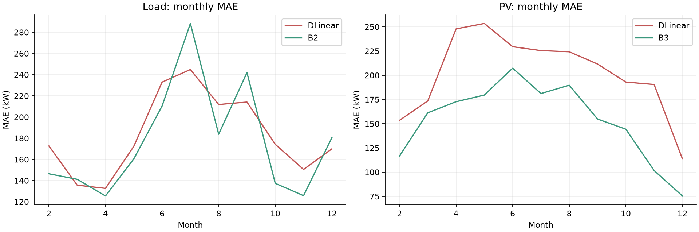
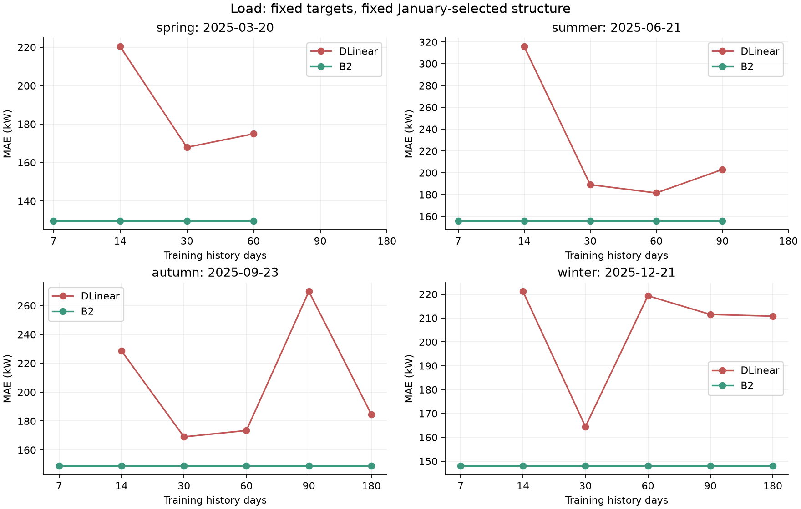
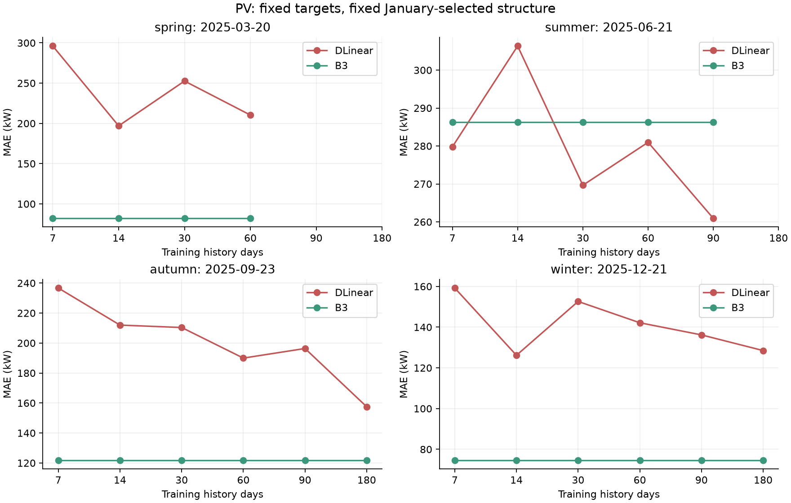

# MODEL COMPARISON — DLinear Stage 1

**只实现DLinear；项目已迁移到D:/数学建模/CUMCM2026C_TS_Baseline。沿用TIME_PROTOCOL.md、canonical_actuals.csv和EventTime。未使用附件3/4、result模板或优化。**

## 1. January validation选择

| series | seq_len | validation_mae_kw | best_epoch | epochs_executed | train_points | validation_points | window_count |
|---|---|---|---|---|---|---|---|
| Load | 144 | 689.6668 | 50 | 50 | 3456 | 1008 | 3169 |
| Load | 432 | 671.9859 | 50 | 50 | 3456 | 1008 | 2881 |
| Load | 1008 | 146.7398 | 49 | 50 | 3456 | 1008 | 2305 |
| PV | 144 | 213.2884 | 50 | 50 | 3456 | 1008 | 3169 |
| PV | 432 | 162.7873 | 46 | 50 | 3456 | 1008 | 2881 |
| PV | 1008 | 164.8420 | 7 | 15 | 3456 | 1008 | 2305 |

Load冻结seq_len=1008、epochs=49；PV冻结seq_len=432、epochs=46。只按1月25–31日验证MAE选择。前24天fit，后7天不进入初次拟合或scaler；验证日context使用当时最新历史。详见MODEL_SELECTION.md。

选定后每月用该月之前全部历史重新训练，包括已成为合法历史的原1月验证段。固定结构、学习率、批量和轮数，不用Feb–Dec重新选择。

## 2–3. DLinear与强简单基线

| series | model | n | mae_kw | rmse_kw | nmae | daylight_mae_kw |
|---|---|---|---|---|---|---|
| Load | B0 | 48096 | 1240.2651 | 1651.3829 | 0.2686 | N/A |
| Load | B1 | 48096 | 650.0201 | 1128.3912 | 0.1408 | N/A |
| Load | B2 | 48096 | 176.7957 | 244.2866 | 0.0383 | N/A |
| Load | B3 | 48096 | 781.2111 | 955.9245 | 0.1692 | N/A |
| Load | B4 | 48096 | 318.5404 | 415.4876 | 0.0690 | N/A |
| PV | B0 | 48096 | 2378.8535 | 3826.0687 | 1.0000 | 4256.4487 |
| PV | B1 | 48096 | 185.3465 | 375.1749 | 0.0779 | 331.6338 |
| PV | B2 | 48096 | 214.6882 | 419.9480 | 0.0902 | 383.9103 |
| PV | B3 | 48096 | 153.3997 | 303.8577 | 0.0645 | 274.3842 |
| PV | B4 | 48096 | 492.6306 | 787.3104 | 0.2071 | 856.4944 |
| Load | DLinear | 48096 | 182.9798 | 235.3459 | 0.0396 | N/A |
| PV | DLinear | 48096 | 201.6898 | 328.1107 | 0.0848 | 307.0546 |

| series | model_baseline | mae_kw_baseline | mae_kw_dlinear | absolute_improvement_kw | relative_improvement_pct |
|---|---|---|---|---|---|
| Load | B2 | 176.7957 | 182.9798 | -6.1841 | -3.4979 |
| PV | B3 | 153.3997 | 201.6898 | -48.2901 | -31.4799 |

MAE/RMSE单位kW；nMAE为比例。Improvement=(baseline MAE−DLinear MAE)/baseline MAE；负数为退步。PV daylight-only仅在事后评价时用actual>0，未用于模型输入。输出不裁剪、不加真实夜间掩码。

Load：DLinear未超过B2，MAE差额-6.1841 kW，相对改善-3.50%。

RMSE：244.2866 → 235.3459 kW（相对改善3.66%）。成功门槛仍按预注册的MAE判定，不事后切换指标。

PV：DLinear未超过B3，MAE差额-48.2901 kW，相对改善-31.48%。

RMSE：303.8577 → 328.1107 kW（相对改善-7.98%）。成功门槛仍按预注册的MAE判定，不事后切换指标。

## 4. Monthly表现

| series | month | mae_kw_baseline | mae_kw_dlinear | relative_improvement_pct |
|---|---|---|---|---|
| Load | 2025-02 | 146.4379 | 172.6845 | -17.9233 |
| Load | 2025-03 | 141.2300 | 135.7032 | 3.9134 |
| Load | 2025-04 | 125.5226 | 132.6820 | -5.7037 |
| Load | 2025-05 | 160.4789 | 172.3400 | -7.3911 |
| Load | 2025-06 | 210.3437 | 232.9023 | -10.7246 |
| Load | 2025-07 | 288.2680 | 244.8074 | 15.0765 |
| Load | 2025-08 | 183.7784 | 211.7892 | -15.2417 |
| Load | 2025-09 | 241.8969 | 214.1226 | 11.4819 |
| Load | 2025-10 | 137.4345 | 174.2411 | -26.7812 |
| Load | 2025-11 | 125.7949 | 150.5296 | -19.6626 |
| Load | 2025-12 | 180.5123 | 169.9254 | 5.8649 |
| PV | 2025-02 | 116.5683 | 153.4600 | -31.6481 |
| PV | 2025-03 | 161.2545 | 173.4903 | -7.5879 |
| PV | 2025-04 | 172.6900 | 247.8511 | -43.5237 |
| PV | 2025-05 | 179.5919 | 253.4513 | -41.1262 |
| PV | 2025-06 | 207.3113 | 229.5004 | -10.7033 |
| PV | 2025-07 | 181.1342 | 225.4945 | -24.4903 |
| PV | 2025-08 | 189.7302 | 224.2562 | -18.1974 |
| PV | 2025-09 | 154.8300 | 211.6155 | -36.6761 |
| PV | 2025-10 | 144.3429 | 192.9788 | -33.6947 |
| PV | 2025-11 | 101.6707 | 190.4992 | -87.3687 |
| PV | 2025-12 | 75.4472 | 113.6690 | -50.6602 |

Load在4/11个月胜过强基线，最差相对改善-26.78%。

PV在0/11个月胜过强基线，最差相对改善-87.37%。

## 5. Horizon表现

Load最高误差3个horizon：h=106（17:30起），MAE=245.16 kW；h=108（17:50起），MAE=239.51 kW；h=48（07:50起），MAE=234.73 kW。

PV最高误差3个horizon：h=71（11:40起），MAE=507.23 kW；h=73（12:00起），MAE=506.69 kW；h=70（11:30起），MAE=504.99 kW。

每天00:00预测，horizon和日内时刻完全耦合，不能把误差峰值单独解释为远期不确定性。夜间actual均值为0时nMAE保留NaN。

## 6. Controlled Low-Data

固定目标日：03-20、06-21、09-23、12-21；只改变其之前7/14/30/60/90/180天的拟合预算。B0–B4均在同样预算内重新计算。每季只有一天，不能据此概括整个季节。

| series | target_group | history_days | status | MAE | RMSE | nMAE | reason |
|---|---|---|---|---|---|---|---|
| Load | spring | 7 | skipped | N/A | N/A | N/A | insufficient_points_for_context_plus_target |
| Load | spring | 14 | completed | 220.3109 | 273.1154 | 0.0449 | N/A |
| Load | spring | 30 | completed | 167.9154 | 207.2902 | 0.0343 | N/A |
| Load | spring | 60 | completed | 174.9054 | 220.5053 | 0.0357 | N/A |
| Load | spring | 90 | skipped | N/A | N/A | N/A | insufficient_available_history |
| Load | spring | 180 | skipped | N/A | N/A | N/A | insufficient_available_history |
| PV | spring | 7 | completed | 296.1056 | 366.7310 | 0.1282 | N/A |
| PV | spring | 14 | completed | 196.9303 | 259.9812 | 0.0853 | N/A |
| PV | spring | 30 | completed | 252.6080 | 314.6708 | 0.1094 | N/A |
| PV | spring | 60 | completed | 210.3737 | 292.3254 | 0.0911 | N/A |
| PV | spring | 90 | skipped | N/A | N/A | N/A | insufficient_available_history |
| PV | spring | 180 | skipped | N/A | N/A | N/A | insufficient_available_history |
| Load | summer | 7 | skipped | N/A | N/A | N/A | insufficient_points_for_context_plus_target |
| Load | summer | 14 | completed | 315.7368 | 384.0809 | 0.0931 | N/A |
| Load | summer | 30 | completed | 189.0534 | 241.8105 | 0.0557 | N/A |
| Load | summer | 60 | completed | 181.4823 | 232.5472 | 0.0535 | N/A |
| Load | summer | 90 | completed | 203.0111 | 254.4708 | 0.0598 | N/A |
| Load | summer | 180 | skipped | N/A | N/A | N/A | insufficient_available_history |
| PV | summer | 7 | completed | 279.7878 | 378.5796 | 0.1082 | N/A |
| PV | summer | 14 | completed | 306.3486 | 458.4122 | 0.1184 | N/A |
| PV | summer | 30 | completed | 269.6564 | 457.3009 | 0.1043 | N/A |
| PV | summer | 60 | completed | 280.9770 | 413.4501 | 0.1086 | N/A |
| PV | summer | 90 | completed | 260.9245 | 415.5086 | 0.1009 | N/A |
| PV | summer | 180 | skipped | N/A | N/A | N/A | insufficient_available_history |
| Load | autumn | 7 | skipped | N/A | N/A | N/A | insufficient_points_for_context_plus_target |
| Load | autumn | 14 | completed | 228.5557 | 287.5642 | 0.0453 | N/A |
| Load | autumn | 30 | completed | 169.0149 | 212.7479 | 0.0335 | N/A |
| Load | autumn | 60 | completed | 173.3977 | 220.4772 | 0.0343 | N/A |
| Load | autumn | 90 | completed | 269.7929 | 305.2890 | 0.0534 | N/A |
| Load | autumn | 180 | completed | 184.6069 | 221.9834 | 0.0366 | N/A |
| PV | autumn | 7 | completed | 236.6919 | 309.3368 | 0.0962 | N/A |
| PV | autumn | 14 | completed | 211.9660 | 283.2986 | 0.0861 | N/A |
| PV | autumn | 30 | completed | 210.3598 | 270.9871 | 0.0855 | N/A |
| PV | autumn | 60 | completed | 189.9550 | 292.8525 | 0.0772 | N/A |
| PV | autumn | 90 | completed | 196.3599 | 291.0974 | 0.0798 | N/A |
| PV | autumn | 180 | completed | 157.4982 | 243.8889 | 0.0640 | N/A |
| Load | winter | 7 | skipped | N/A | N/A | N/A | insufficient_points_for_context_plus_target |
| Load | winter | 14 | completed | 221.1805 | 281.4560 | 0.0427 | N/A |
| Load | winter | 30 | completed | 164.4596 | 200.6594 | 0.0317 | N/A |
| Load | winter | 60 | completed | 219.3401 | 269.8124 | 0.0423 | N/A |
| Load | winter | 90 | completed | 211.5261 | 258.6430 | 0.0408 | N/A |
| Load | winter | 180 | completed | 210.7956 | 268.7270 | 0.0407 | N/A |
| PV | winter | 7 | completed | 159.2171 | 255.2337 | 0.1081 | N/A |
| PV | winter | 14 | completed | 126.1648 | 210.1574 | 0.0857 | N/A |
| PV | winter | 30 | completed | 152.6231 | 242.2866 | 0.1037 | N/A |
| PV | winter | 60 | completed | 142.1566 | 230.7669 | 0.0965 | N/A |
| PV | winter | 90 | completed | 136.1891 | 229.9183 | 0.0925 | N/A |
| PV | winter | 180 | completed | 128.4946 | 235.4377 | 0.0873 | N/A |

历史不足或seq_len+144超过可用点数的组合明确跳过，不修改seq_len凑结果。结构来自共同的January模型设计阶段，因此N天是本次参数拟合预算，并非整个研究设计阶段的数据预算。

Load四个固定目标日从14天增至30天均改善，但更长历史不保证进一步改善；PV曲线同样非单调。扩大历史同时改变季节覆盖及固定轮数下的优化步数，不能把曲线全部归因于统计样本量。

Load低数据有效组合中，DLinear胜过B2的数量为0/17。这是固定四天的描述性比较，不是按测试日挑选历史长度。

PV低数据有效组合中，DLinear胜过B3的数量为4/21。这是固定四天的描述性比较，不是按测试日挑选历史长度。

## 7. 过拟合与稳定性

Load最佳验证MAE=146.7398，末轮=147.4357 kW。存在末段验证回落，已保留最佳权重和轮数。训练MSE和验证MAE量纲不同，不直接比较数值大小。

PV最佳验证MAE=162.7873，末轮=163.1594 kW。存在末段验证回落，已保留最佳权重和轮数。训练MSE和验证MAE量纲不同，不直接比较数值大小。

选中模型的末轮退化均不足1 kW，仅说明轻微验证波动，不能据此断言严重过拟合。PV的1008点候选在第7轮达到最佳、第15轮早停，提示更长输入存在验证退化风险。验证只有7天，模型选择稳定性证据有限；未超过全年基线也不能单独证明过拟合。

| series | n_seeds | mae_mean_kw | mae_std_kw | rmse_mean_kw | rmse_std_kw |
|---|---|---|---|---|---|
| Load | 1 | 182.9798 | N/A | 235.3459 | N/A |
| PV | 1 | 201.6898 | N/A | 328.1107 | N/A |

seed2026仅在胜过强基线的序列上补2027/2028，沿用相同结构和轮数，不选择最好seed；std为样本标准差，单seed时留空。

## 8. Causality tests

| suite | tests | failures | skipped |
|---|---|---|---|
| seasonal_regression | 59 | 0 | 0 |
| learned_preflight | 31 | 0 | 0 |
| learned_postflight | 8 | 0 | 0 |

共98项全部通过，含原59项。窗口和scaler的最晚available_event都早于训练cutoff事件，训练数据和checkpoint hash可追踪，真实Feb/Mar模型对未来actual污染的预测逐位不变。

信息可用性按rank0先于rank2；这是离线回测，计算时间另报，未将实际训练耗时作为在线决策延迟建模。

## 样本量及复现

每序列全年52,560点、365个日周期。1月候选fit为3,456点、24个周期；验证1,008点、7个周期。滑窗stride=1高度重叠，window_count不是独立样本数；effective_day_cycles也不声称各天统计独立。

| phase | series | fits | training_seconds | max_parameters |
|---|---|---|---|---|
| controlled_low_data | Load | 17 | 100.6040 | 290592 |
| controlled_low_data | PV | 21 | 102.2027 | 124704 |
| january_selection | Load | 3 | 20.9359 | 290592 |
| january_selection | PV | 3 | 13.4841 | 290592 |
| operational | Load | 11 | 216.7258 | 290592 |
| operational | PV | 11 | 204.3360 | 124704 |

复现入口：python run_dlinear.py。仅在config和训练数据hash匹配时复用checkpoint；没有checkpoint时从头训练。全部数值由程序生成。环境与版本见artifacts/dlinear/environment.json。

固定[TSLib提交4e938a1](https://github.com/thuml/Time-Series-Library/tree/4e938a1767106324dd753b2a44832bf870a0252e)；原始代码、LICENSE和哈希见vendor/tslib。

## 9. 是否值得继续PatchTST？

两条序列均未超过强基线，当前不支持纳入最终方案或立即扩展PatchTST；不能用本次test反向调参后仍当作原始评估。

在DLinear阶段停止，未继续PatchTST。

